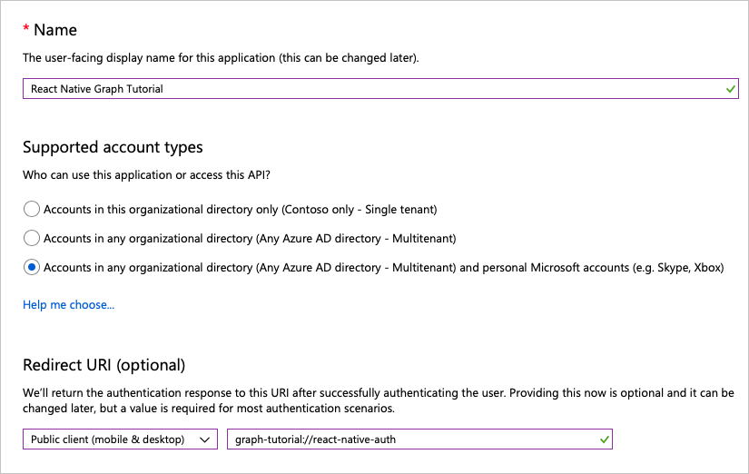

<!-- markdownlint-disable MD002 MD041 -->

En este ejercicio, creará una nueva aplicación nativa de Azure AD con el centro de administración de Azure Active Directory.

1. Abra un explorador y vaya al [centro de administración de Azure Active Directory](https://aad.portal.azure.com) e inicie sesión con una **cuenta personal** (también conocida como: cuenta Microsoft) o una **cuenta profesional o educativa**.

1. Seleccione **Azure Active Directory** en el panel de navegación de la izquierda y, después, seleccione **registros de aplicaciones** en **administrar**.

    

1. Seleccione **Nuevo registro**. En la página **Registrar una aplicación**, establezca los valores siguientes.

    - Establezca **Nombre** como `React Native Graph Tutorial`.
    - Establezca **Tipos de cuenta admitidos** en **Cuentas en cualquier directorio de organización y cuentas personales de Microsoft**.
    - En **URI de redireccionamiento**, cambie la lista desplegable a **cliente público (móvil & escritorio)** y establezca `graph-tutorial://react-native-auth`el valor en.

    

1. Seleccione **registrar**. En la página de **tutorial de reAct de gráficos nativos** , copie el valor del identificador de la **aplicación (cliente)** y guárdelo, lo necesitará en el paso siguiente.

    

1. En **administrar**, seleccione **autenticación**. En la página **URI de redireccionamiento** , agregue otro URI de redireccionamiento de tipo **cliente público (móvil & escritorio)**, con el URI `urn:ietf:wg:oauth:2.0:oob`. Haga clic en **Guardar**.

    
