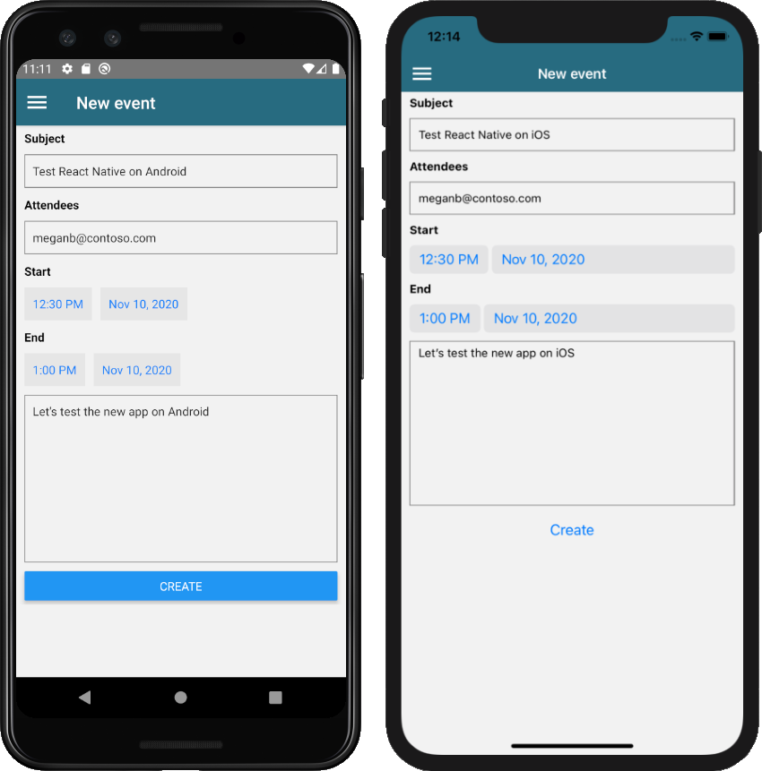

<!-- markdownlint-disable MD002 MD041 -->

En esta sección, agregará la capacidad de crear eventos en el calendario del usuario.

## <a name="create-the-new-event-screen"></a>Crear la nueva pantalla de eventos

1. Abra **./Graph/GraphManager.ts** y agregue la siguiente función a la `GraphManager` clase.

    :::code language="typescript" source="../demo/GraphTutorial/graph/GraphManager.ts" id="CreateEventSnippet":::

    Esta función usa Graph SDK para crear un nuevo evento.

1. Cree un nuevo archivo en el archivo **./Screens** denominado **NewEventScreen. TSX** y agregue el siguiente código.

    :::code language="typescript" source="../demo/GraphTutorial/screens/NewEventScreen.tsx" id="NewEventScreenSnippet":::

    Tenga en cuenta lo que `createEvent` hace la función. Crea un `MicrosoftGraph.Event` objeto con los valores del formulario y, a continuación, pasa ese objeto a la `GraphManager.createEvent` función.

1. Abra **./menus/DrawerMenu.TSX** y agregue la siguiente `import` instrucción en la parte superior del archivo.

    ```typescript
    import NewEventScreen from '../screens/NewEventScreen';
    ```

1. Agregue el siguiente código dentro del `<Drawer.Navigator>` elemento, justo encima de la `</Drawer.Navigator>` línea.

    ```typescript
    { userLoaded &&
      <Drawer.Screen name='NewEvent'
        component={NewEventScreen}
        options={{drawerLabel: 'New event'}} />
    }
    ```

1. Guarde los cambios y reinicie o actualice la aplicación. Seleccione la opción **nuevo evento** en el menú para ir al nuevo formulario de eventos.

1. Rellene el formulario y seleccione **crear**.

    
